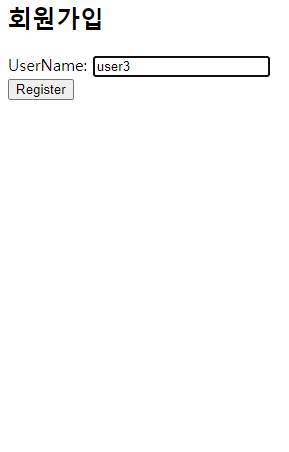
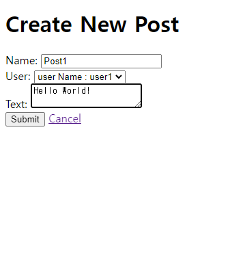
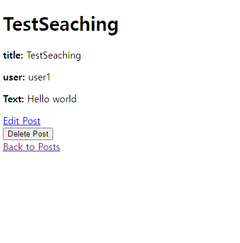
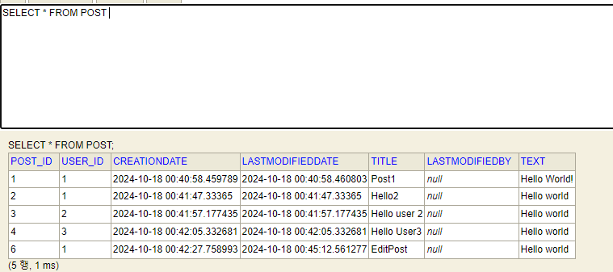
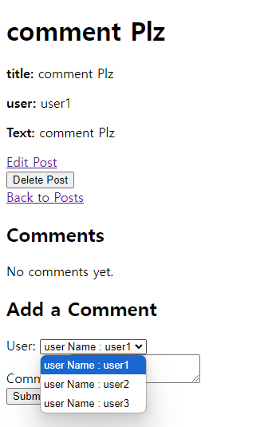
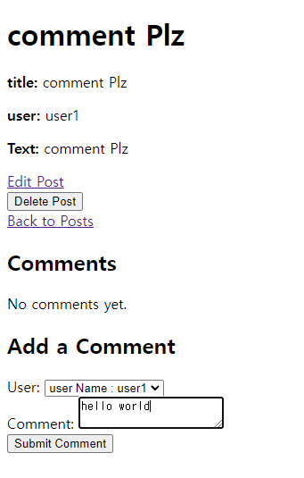
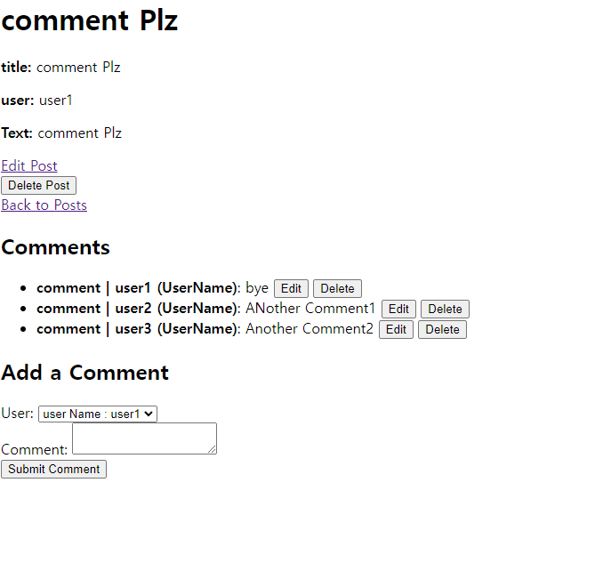

## 게시판 기능 구현

### 유저 등록
  
현재 화면에서 Create User 버튼을 클릭하여 유저를 등록하는 화면으로 넘어가도록 Get 요청을 보냅니다. 

   
유저 등록입니다.  
   
   
   

    
유저 등록후 DB에도 정상적으로 등록이 되어있습니다

### 게시글 등록
  
현재 화면에서 Creat New Post 버튼을 클릭하여 포스트 등록하는 화면으로 넘어가도록 Get 요청을 보냅니다. 

  
전에 등록하였던 유저를 선택할 수 있습니다.  
  
    
포스트 작성자의 이름을 볼 수 있습니다.  

  
  
페이지를 전환하여 페이지 전환을 보여줍니다  

### 작성글 검색 by UserName
  
검색창에 검색한 유저의 이름으로 검색을 하여 작성한 포스트을 보여줍니다  

 
 ### 포스트 수정
  
Action 쪽의 View 텍스트를 클릭하여 자세히 보기 요청을 보냅니다.

  
자세히 보기 화면입니다  
>** TestSeaching 이라는 제목을 글을 수정하는것이 아닌  그 밑을 Something 글을 수정하는겁니다. **

  
포스트 수정 화면에 들어가서 포스트 수정을 시도합니다.  
  
포스트 수정후 게시판 모습입니다  

### 포스트 삭제

   
포스트중 하나를 삭제하려고 합니다 .   
  
삭제버튼을 누르니 삭제 알림이 나옵니다  
    
수정와 삭제가 완료된 최종 게시판의 모습입니다  

수정와 삭제가 완료된 최종 POST DB의 모습입니다   

### 댓글 기능 추가
> **lastModifiedBy** 는 임의로 만들어놨는데 실수로 지우지 않아서 추가된 컬럼입니다.

   
댓글 기능 추가후 포스트에서 댓글을 볼 수 있습니다  

  
포스트 처럼 댓글을 작성할 유저를 선택할 수 있습니다. 

  
댓글를 추가할려고 합니다.  

  
정상적으로 댓글이 추가되었습니다.  

  
임의로 여러개의 유저로 여러개의 댓글을 달았습니다.  

   
데이터 베이스에 정상적으로 업데이트가 되었습니다.  

   
edit 버튼을 눌러서 댓글을 수정하는 페이지로 넘어왔습니다.   

    
댓글을 이런식으로 수정하려고 합니다.   

    
댓글 수정후 포스트 내부 모습입니다 .  

     
수정된 댓글이 db에 정상적으로 잘 반영되었습니다.  

     
Anthor 라는 내용을 가진 댓글을 삭제하려고 삭제버튼을 눌렀습니다   

     
삭제후 포스트 내부 모습입니다.   

     
삭제한것도 DB에 정상적으로 반영이 되었습니다.    